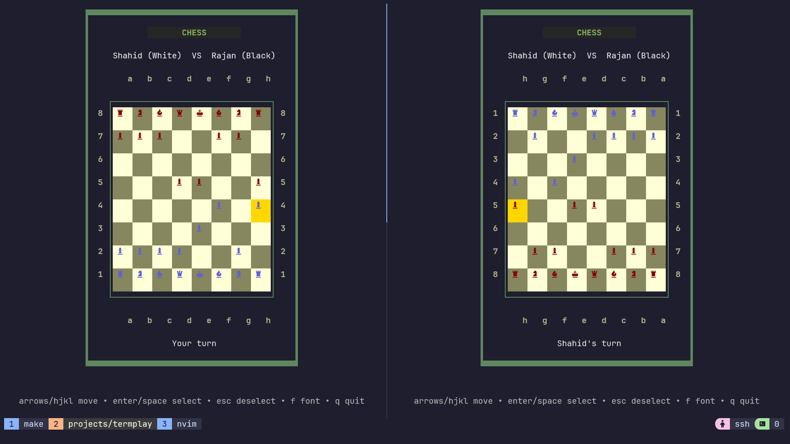
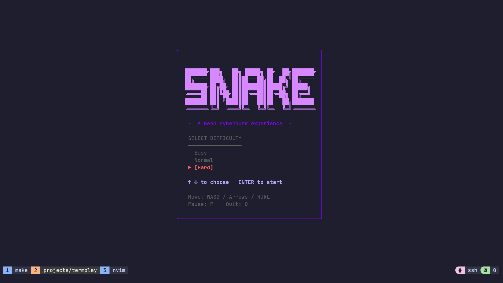

# TermPlay


Play real-time multiplayer Chess and Tic-Tac-Toe, or challenge yourself with Snake straight from your terminal. No installs, no accounts needed. Just SSH and play.

## Features

*   **Three Games**: Switch between Chess, Tic-Tac-Toe, and Snake.
*   **Zero Install**: It runs over SSH. If you have a terminal, you can play.
*   **Instant Multiplayer**: Create a room, get a 4-letter code, and share it.
*   **Single-Player Snake**: Pick a difficulty and chase your high score.
*   **Spectator Mode**: Watch live games by joining a full room.
*   **Slick TUI**: A responsive, colorful terminal interface built with Bubble Tea.
*   **Cross-Platform State**: Game state lives in Firebase, so you can reconnect if your wifi drops.

## Demo

https://github.com/user-attachments/assets/0bfcccc5-ecb1-45cc-b4f4-55dc0bf07b33

## Play Now

The public server is coming soon! Once live, you'll be able to jump in with:

```bash
ssh termplay.me
```

## Screenshots

<p align="center">
  
  &nbsp; &nbsp;
  
</p>

<p align="center">
  
  &nbsp; &nbsp;
  
</p>
<p align="center">
 
</p>


## Run It Yourself

Want to host your own server? Here's how.

### Prerequisites
You'll need a Firebase project (Realtime Database).
1.  Go to **Project Settings > Service Accounts** in Firebase Console.
2.  Generate a **Private Key** and save it as `serviceAccount.json`.
3.  Grab your Database URL from the Realtime Database section.

### Local Development

1.  Clone the repo and drop your `serviceAccount.json` in the root folder.
2.  Create a `.env` file:
    ```env
    FIREBASE_DB_URL=https://YOUR-PROJECT-ID-default-rtdb.firebaseio.com
    GOOGLE_APPLICATION_CREDENTIALS=./serviceAccount.json
    ```
3.  Run it:
    ```bash
    make run
    ```
4.  Connect in a new tab:
    ```bash
    ssh -p 2324 localhost
    ```

### Docker

```bash
docker run -d -p 2324:2324 \
  -e FIREBASE_DB_URL="https://YOUR-DB-URL.firebaseio.com" \
  -e GOOGLE_APPLICATION_CREDENTIALS="/app/serviceAccount.json" \
  -v "$(pwd)/serviceAccount.json:/app/serviceAccount.json" \
  ghcr.io/aminshahid573/termplay:latest
```

---
*Built with Go, Bubble Tea, and Wish.*
